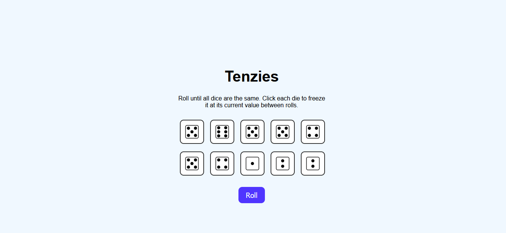
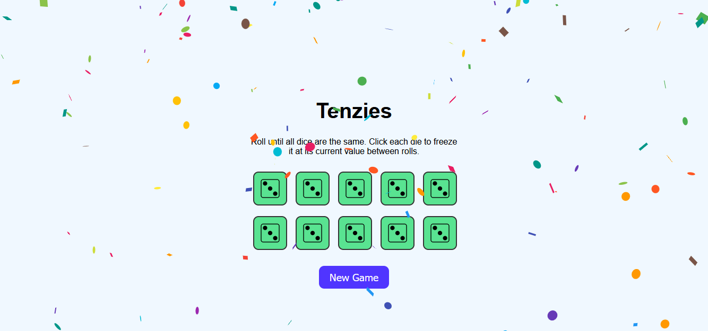

# 🎲 Tenzies Game – React

A modern and interactive **Tenzies game** built with **React**.
The goal is to roll 10 dice until they all show the same number.
You can "hold" dice to keep their value between rolls. A fun and visual game that demonstrates core React concepts, state management, and basic game logic.

---

## 🕹️ How to Play

1. Click the **Roll** button to roll all dice.
2. Click on any die to **hold** it — it won’t be rolled again.
3. Continue rolling until **all dice show the same number** and are held.
4. 🎉 **Confetti** appears when you win. Click "New Game" to restart.

---

## 🔗 Demo

[PLAY](https://tenzies-game-react-js.vercel.app/)

---

## ✨ Features

- 🎲 Roll 10 dice using custom images
- 🖱️ Click to hold/unhold individual dice
- 🎉 Confetti explosion on win
- 🧼 Clean, minimal UI with responsive layout
- ♻️ "New Game" resets everything

---

## ⚙️ Tech Stack

- **React** – Frontend UI Library
- **React Confetti** – Celebration animation
- **Custom Image Assets** – Dice face images (`diceFace1.png` to `diceFace6.png`)
- **CSS** – Styling and layout

---

## 📚 Learning Objectives

Through building this project, the following skills and concepts were practiced:

- ⚛️ Building components and managing state with React
- 🎯 Using `useEffect` for side effects and win condition logic
- 🧩 Structuring React projects with reusable components
- 🎉 Integrating third-party packages like `react-confetti`
- 🖼️ Handling image assets and dynamic rendering
- 🧪 Creating a simple game loop with conditional rendering

---

## 📸 Screenshots

## 🎮 Game



## 🎉 Win State



---

### 📁 Folder Structure

```
tenzies-game/
├── public/
│ └── favicon.svg
├── src/
│ └── assets/
|   └── diceFace1.png
|   └── diceFace2.png
|   └── diceFace3.png
|   └── diceFace4.png
|   └── diceFace5.png
|   └── diceFace6.png
│ └── components/
|   └── Dice.css
|   └── Dice.jsx
│ ├── App.css
│ ├── App.jsx
│ ├── index.css
│ ├── main.jsx
├── .gitignore
├── index.html
├── package-lock.json
├── package.json
├── screenshot-win.png
├── screenshot.png
├── README.md

```
---

## 🙌 Acknowledgments

Inspired by the classic Tenzies dice game.
Built as a fun coding project to practice component-based development.

---

## 🎉 Enjoy the game and feel free to contribute!
