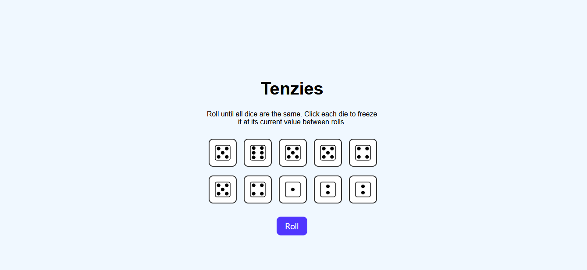
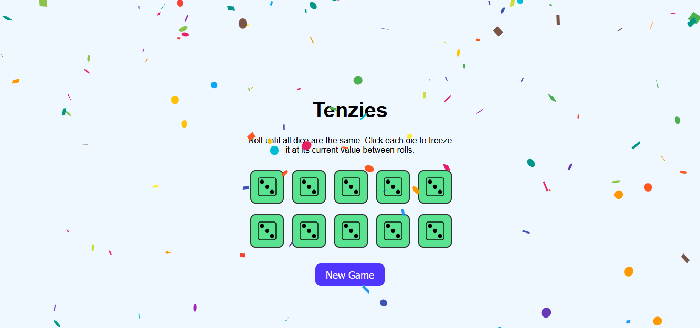

<<<<<<< HEAD
🎲 Tenzies Game – React
A modern and interactive Tenzies game built with React.
The goal is to roll 10 dice until they all show the same number.
You can "hold" dice to keep their value between rolls. A fun and visual game that demonstrates core React concepts, state management, and basic game logic.

🕹️ How to Play
Click the Roll button to roll all dice.
Click on any die to hold it — it won’t be rolled again.
Continue rolling until all dice show the same number and are held.
🎉 Confetti appears when you win. Click "New Game" to restart.
🔗 Demo
Visit Live Site

✨ Features
🎲 Roll 10 dice using custom images
🖱️ Click to hold/unhold individual dice
🎉 Confetti explosion on win
🧼 Clean, minimal UI with responsive layout
♻️ "New Game" resets everything
⚙️ Tech Stack
React – Frontend UI Library
React Confetti – Celebration animation
Custom Image Assets – Dice face images (diceFace1.png to diceFace6.png)
CSS – Styling and layout
📚 Learning Objectives
Through building this project, the following skills and concepts were practiced:

⚛️ Building components and managing state with React
🎯 Using useEffect for side effects and win condition logic
🧩 Structuring React projects with reusable components
🎉 Integrating third-party packages like react-confetti
🖼️ Handling image assets and dynamic rendering
🧪 Creating a simple game loop with conditional rendering

## 📸 Screenshots

### 🎮 Game UI



### 🎉 Winning State



## 📁 Folder Structure

```
tenzies-game/
├── public/
├── src/
│   └── images/
│       ├── diceFace1.png
│       ├── diceFace2.png
│       ├── diceFace3.png
│       ├── diceFace4.png
│       ├── diceFace5.png
│       └── diceFace6.png
│   ├── App.css
│   ├── App.js
│   ├── Dice.css
│   ├── Dice.js
│   ├── index.css
│   └── index.js
├── .gitignore
├── README.md
├── package-lock.json
├── package.json
├── screenshot-win.png
├── screenshot.png
```

---

## 🙌 Acknowledgments

Inspired by the classic Tenzies dice game.

Built as a fun coding project to practice component-based development.

---

=======
# 🎲 Tenzies Game – React

A modern and interactive **Tenzies game** built with **React**.  
The goal is to roll 10 dice until they all show the same number.  
You can "hold" dice to keep their value between rolls. A fun and visual game that demonstrates core React concepts, state management, and basic game logic.

---

## 🕹️ How to Play

1. Click the **Roll** button to roll all dice.
2. Click on any die to **hold** it — it won’t be rolled again.
3. Continue rolling until **all dice show the same number** and are held.
4. 🎉 **Confetti** appears when you win. Click "New Game" to restart.

---

## 🔗 Demo

[Visit Live Site](https://tenzies-game-react-js.vercel.app/)

---

## ✨ Features

- 🎲 Roll 10 dice using custom images
- 🖱️ Click to hold/unhold individual dice
- 🎉 Confetti explosion on win
- 🧼 Clean, minimal UI with responsive layout
- ♻️ "New Game" resets everything

---

## ⚙️ Tech Stack

- **React** – Frontend UI Library
- **React Confetti** – Celebration animation
- **Custom Image Assets** – Dice face images (`diceFace1.png` to `diceFace6.png`)
- **CSS** – Styling and layout

---

## 📚 Learning Objectives

Through building this project, the following skills and concepts were practiced:

- ⚛️ Building components and managing state with React
- 🎯 Using `useEffect` for side effects and win condition logic
- 🧩 Structuring React projects with reusable components
- 🎉 Integrating third-party packages like `react-confetti`
- 🖼️ Handling image assets and dynamic rendering
- 🧪 Creating a simple game loop with conditional rendering

---

## 📸 Screenshots

## 🎮 Game


## 🎉 Win State


---

### 📁 Folder Structure

```
tenzies-game/
├── public/
├── src/
│   └── images/
│       ├── diceFace1.png
│       ├── diceFace2.png
│       ├── diceFace3.png
│       ├── diceFace4.png
│       ├── diceFace5.png
│       └── diceFace6.png
│   ├── App.css
│   ├── App.js
│   ├── Dice.css
│   ├── Dice.js
│   ├── index.css
│   └── index.js
├── .gitignore
├── README.md
├── package-lock.json
├── package.json
├── screenshot-win.png
├── screenshot.png

```
---

## 🙌 Acknowledgments

Inspired by the classic Tenzies dice game.
Built as a fun coding project to practice component-based development.

---

>>>>>>> 8efea983e90bf9001010040981f17a38e7ca30c6
## 🎉 Enjoy the game and feel free to contribute!
